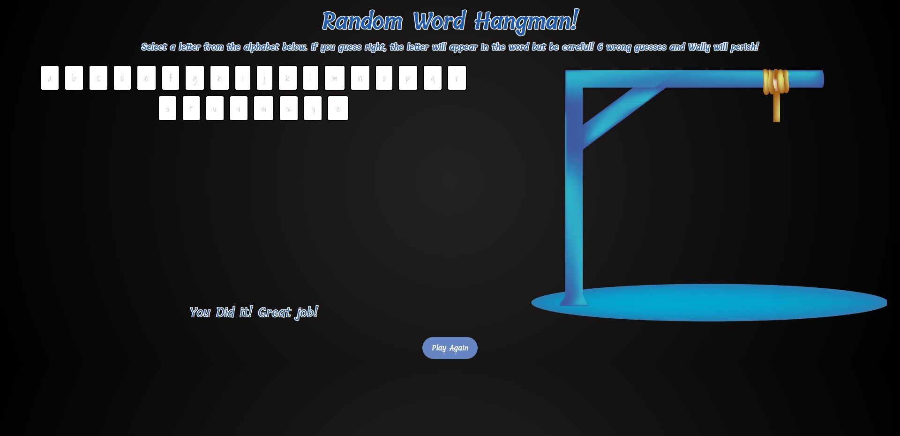

# GA-Hangman-Game
This is a deliverable assignment from the General Assembly Software Engineering Immersive cohort (SEIR-Mariposa). The assignment was to create a hangman game using HTML, CSS and JavaScript. The game is a single player game where the user has to guess the word by inputting letters. The user has 6 lives to guess the word. If the user guesses the word correctly, the user wins. If the user runs out of lives, the user loses.  You are able to click on the letters to guess the word or you can use the keyboard to type in the letters.

## Technologies Used
* HTML
* CSS
* JavaScript

[click here to play the game](https://erictheericx1.github.io/GA-Hangman-Game/)